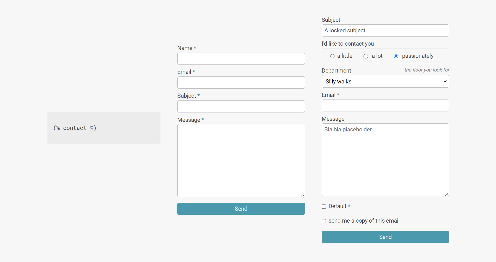

# p01contact

[](https://github.com/nliautaud/p01contact/releases)

Create contact forms by writing simple tags.

- Supports any fields types
- Powerful [textual syntax][syntax]
- Generates [comprehensive mails][emails]
- UTF-8, [localized and multilingual][i18n]
- Automatic [security measures]
- Integrated [settings editor][settings]
- Debug reports and [submission logs][logs]
- Plugin for [GetSimple][GetSimple plugin] or [Pico CMS][Pico CMS plugin]
 


## Usage

Write tags in plain text.

```
This is a default contact form :

(% contact %)

Simple.
```

Follow the [syntax] to create custom forms.

```
(% contact en :
    subject => A locked subject,
    radio "I'd like to contact you" = a little | a lot |: passionately,
    select "Department" (the floor you look for) = Silly walks :| Strange things,
    email!,
    message =< Bla bla placeholder,
    checkbox! "I'm in control",
    askcopy
%)
```

## Installation

Either for [GetSimple CMS] or [Pico CMS], you can :
1. download and unpack the [latest release](https://github.com/nliautaud/p01contact/releases),
2. place `p01contact/` in `plugins/`.

All done.

If you manage Pico with [Composer](https://getcomposer.org/), from the Pico root :
```
composer require nliautaud/p01contact
composer config scripts.post-install-cmd "cp -r vendor/nliautaud/p01contact plugins/p01contact;"
composer install
```

More details can be found in the [wiki] :
- [GetSimple plugin](https://github.com/nliautaud/p01contact/wiki/GetSimple-plugin)
- [Pico CMS plugin](https://github.com/nliautaud/p01contact/wiki/Pico-CMS-plugin)

## Standalone usage

Install, include.

```
composer require nliautaud/p01contact
```
Parse strings containing tags using the [syntax].
```php
$p01contact = new P01contact();
$html = $p01contact->parse('This is a default contact form : (% contact %)');
```

[GetSimple CMS]: http://get-simple.info
[Pico CMS]: http://picocms.org
[GetSimple plugin]: https://github.com/nliautaud/p01contact/wiki/GetSimple-plugin
[Pico CMS plugin]: https://github.com/nliautaud/p01contact/wiki/Pico-CMS-plugin
[wiki]: https://github.com/nliautaud/p01contact/wiki/_pages
[syntax]: https://github.com/nliautaud/p01contact/wiki/Syntax
[settings]: https://github.com/nliautaud/p01contact/wiki/Settings
[security measures]: https://github.com/nliautaud/p01contact/wiki/Settings#security
[i18n]: https://github.com/nliautaud/p01contact/wiki/Localization-(i18n)
[emails]: https://github.com/nliautaud/p01contact/wiki/Emails
[logs]: https://github.com/nliautaud/p01contact/wiki/Logs
