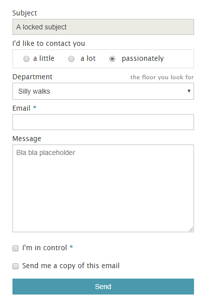

# p01contact

Create contact forms by writing simple tags.

Usage as a plugin for [GetSimple CMS] or [Pico CMS], syntax and settings are documented in the [wiki].


<p align="center">

</p>

## Installation

Download the files.

For [GetSimple CMS], place the `p01-contact` directory and the file `p01-contact_gs.php` in `plugins/`.

For [Pico CMS], place the `p01-contact` directory in `plugins/`.

## Usage as a plugin

Just write tags in your pages.

```
This is a default contact form :

(% contact %)

Simple.
```

Follow the [syntax] to create custom forms.

```
(% contact en :
    subject => A locked subject,
    radio "I'd like to contact you" = a little | a lot |: passionately,
    select "Department" (the floor you look for) = Silly walks :| Strange things,
    email!,
    message <= Bla bla bla,
    checkbox! "I'm in control",
    askcopy
%)
```

Details about usage as a plugin can be found in the [wiki] :
- [GetSimple plugin](https://github.com/nliautaud/p01contact/wiki/GetSimple-plugin)
- [Pico CMS plugin](https://github.com/nliautaud/p01contact/wiki/Pico-CMS-plugin)

## Usage as a PHP script

The simplest method is to include the script, create a new instance and parse strings containing tags using the [syntax].

```php
include 'p01-contact/P01contact.php';

$p01contact = new P01contact();

$content = 'This is a default contact form : (% contact %)'
$content = $p01contact->parse($content);
```

[GetSimple CMS]: http://get-simple.info
[Pico CMS]: http://picocms.org
[wiki]: https://github.com/nliautaud/p01contact/wiki/_pages
[syntax]: https://github.com/nliautaud/p01contact/wiki/Syntax